# Prerequisites

python version: 3.7 or above  
preferred IDE: Visual Studio Code  
preferred OS: Windows 10

## Installation and Setup

### Get the repository

    git clone https://gitlab.engr.illinois.edu/angl2/fa20-cs242-assignment2
    
### Import packages

    use `pip install -e .` to install app

### Running

    set FLASK_APP=src 
    flask run

## Operations and results

### GET

#### get book based on single attribute

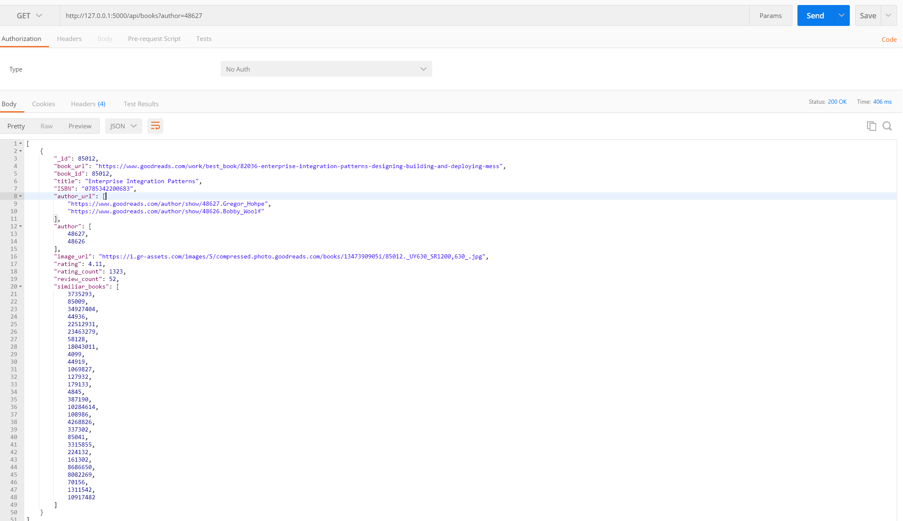

#### get book based on two attributes(and)

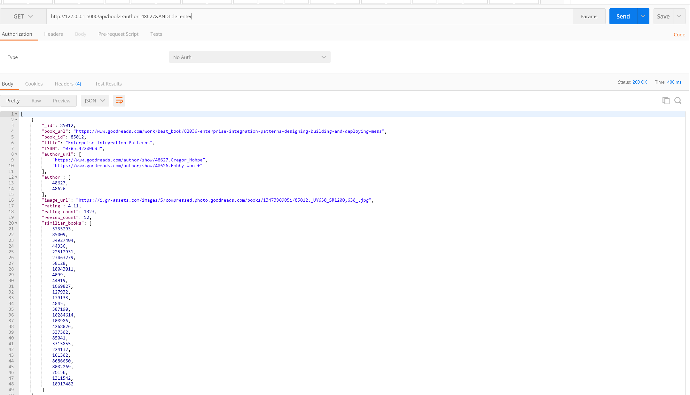

#### get book based on two attributes(or)

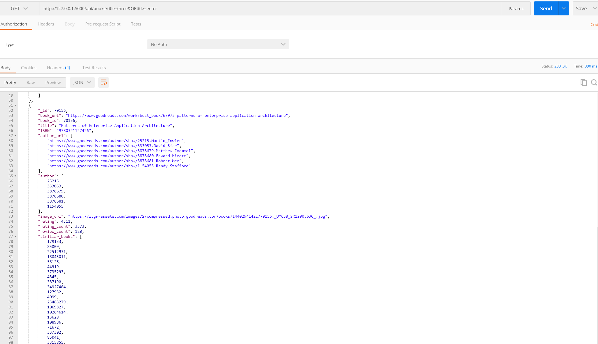

#### get author based on two attributes(and)

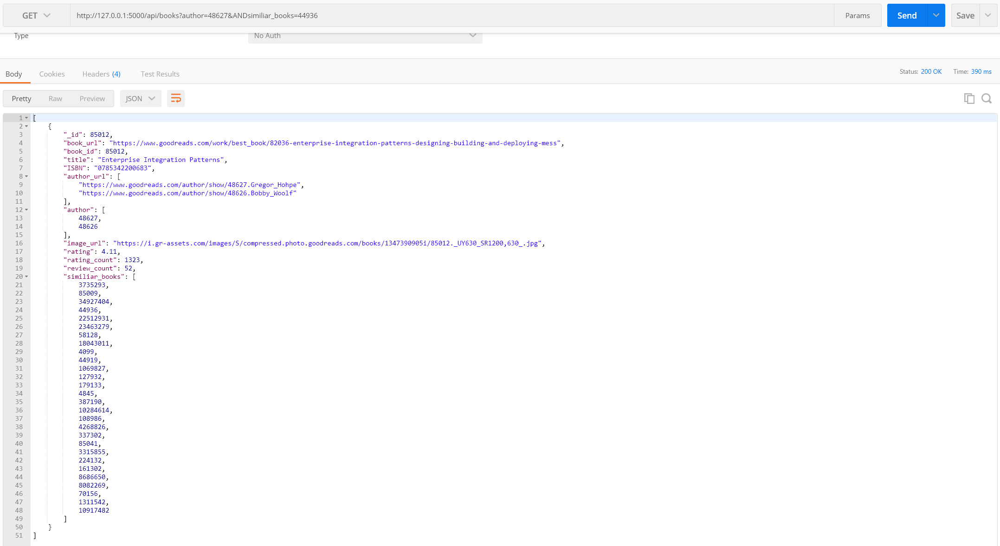

#### get author based on two attributes(or)

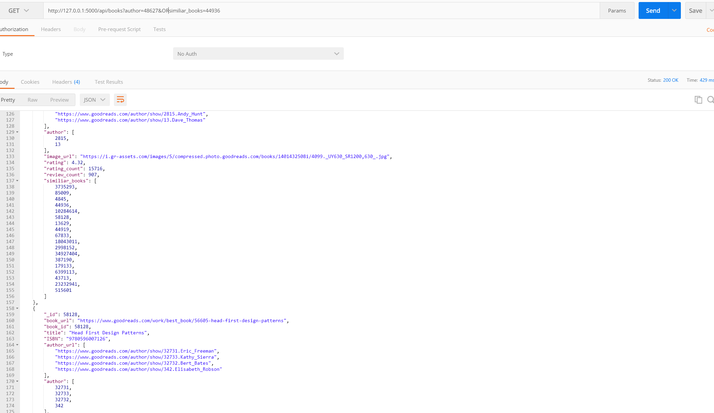

### PUT

#### for book (no new document)

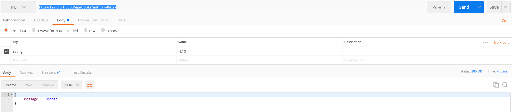

#### for book (create new document)

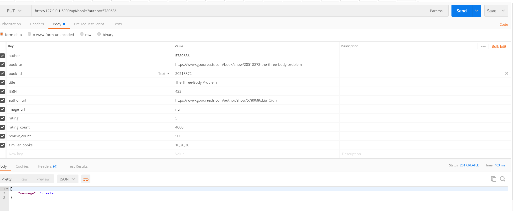

#### if user create agiain, the client will only update insted of creating

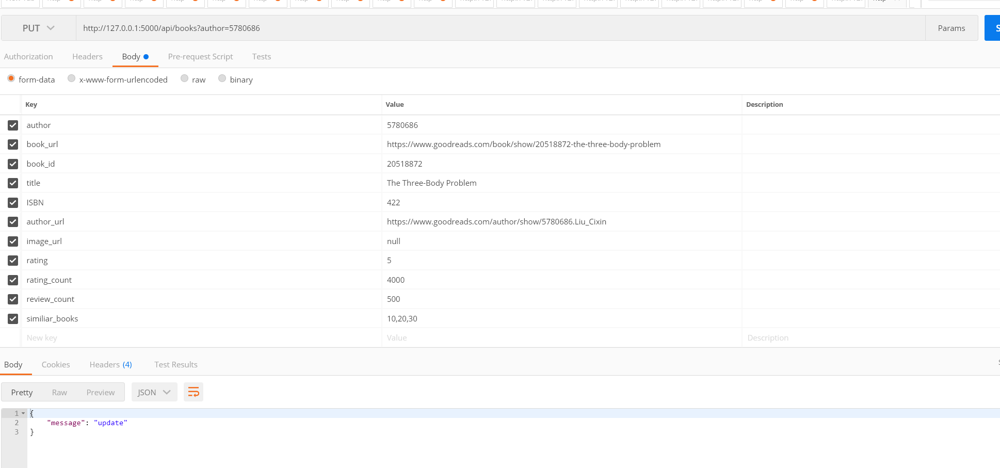

#### for author (create new document)

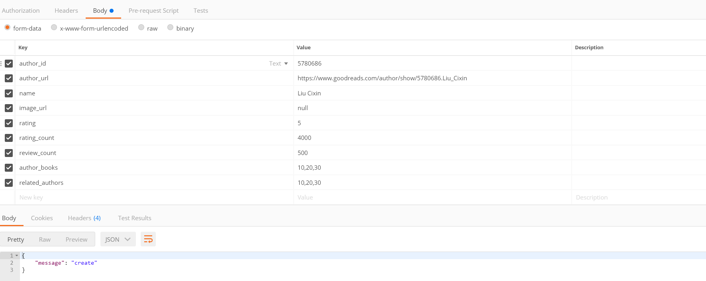

### POST

#### post several books

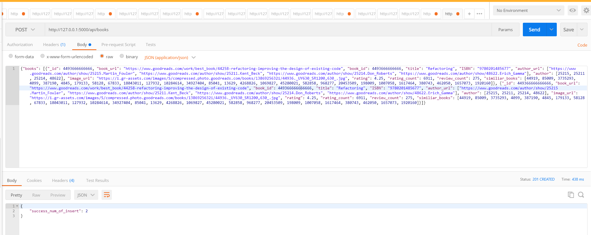

#### post the same two books agian: return 0

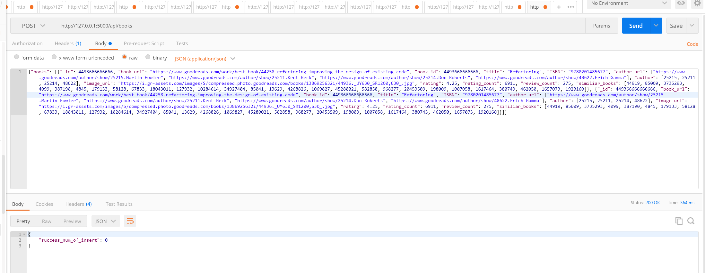

#### post several authors

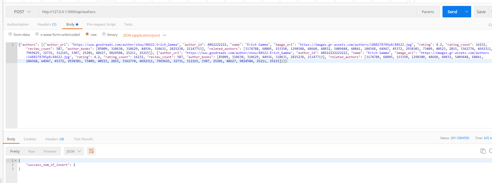

#### if content-type is not json, abort(415)

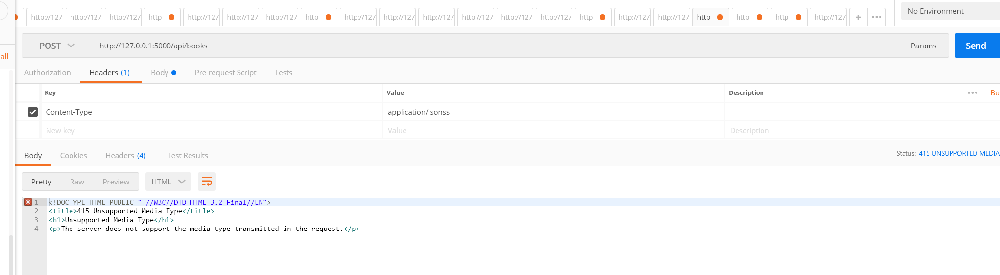

#### post a book

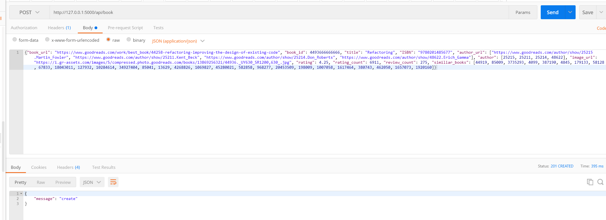

#### post an author
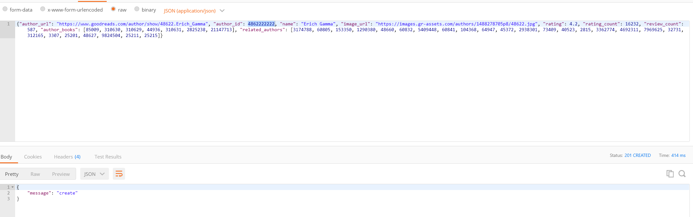

### DELETE

#### delete author which I created for testing posting an author

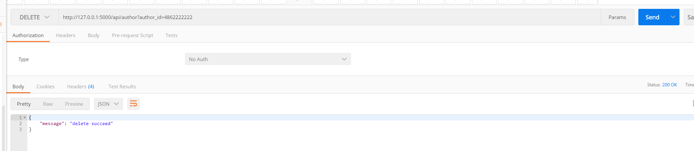

#### delete book which I created for testing posting a book

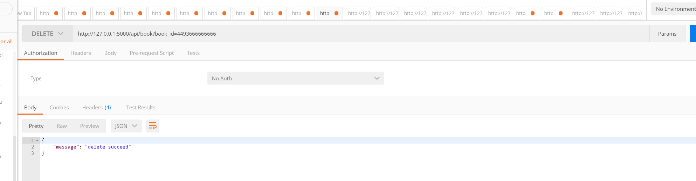
